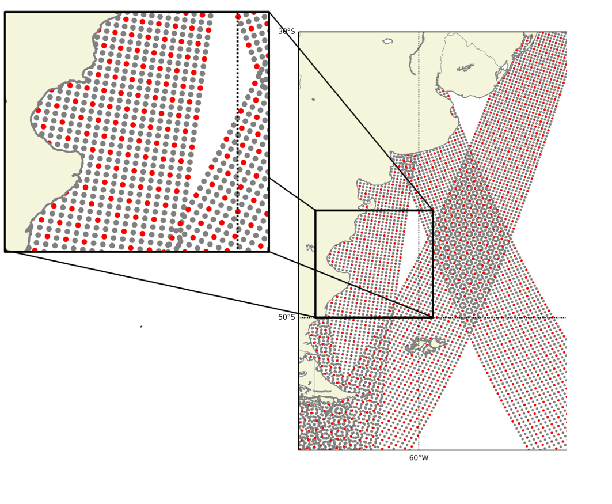

# Ascat Superobbing

This tool was used in the paper Application of the WRF-LETKF Data Assimilation System over Southern South America: Sensitivity to Model Physics http://journals.ametsoc.org/doi/abs/10.1175/WAF-D-14-00157.1 .

We hope this tool will be useful for other researches. It is an ongoing work, in other words, a lot of things are hardcoded or in need of human intervention, although the algorithm is efficient.

*The red one is the final points after apply the technique.*
